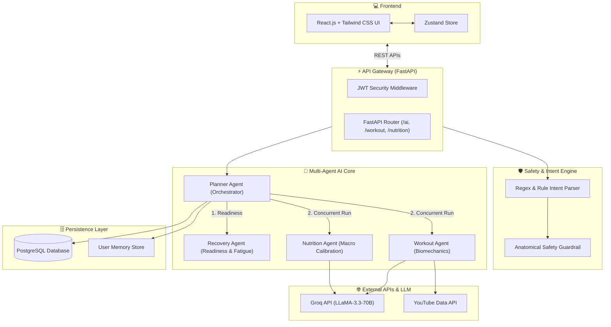

# 🏋️‍♂️ AroMi 2.0 – AI Fitness & Wellness Coach

> **GenAI Forge Hackathon 2026 Project**  
> An adaptive, multi-agent AI fitness and wellness platform delivering hyper-personalized workout routines, macro nutrition planning, and real-time exercise guidance grounded in exercise science and anatomical safety filters.

---

## 🌟 Key Features

- **🧠 Multi-Agent AI Core (LLaMA-3.3-70B via Groq SDK)**: Specialized `PlannerAgent`, `WorkoutAgent`, `NutritionAgent`, and `RecoveryAgent` running concurrently (`asyncio.gather`) for personalized regime generation.
- **🛡️ Deterministic Intent & Safety Engine**: Real-time intent parser (`intent_service.py`) for instant exercise swaps, duration scaling, and anatomical safety filters with a **0.0% safety violation guarantee**.
- **📊 Benchmarked Performance**: Tested against **600+ synthetic user profiles**, achieving **95.6% plan adaptation accuracy** and sub-2ms validation latency.
- **📹 Exercise Form Guidance**: Automatic video tutorial linking powered by **YouTube Data API** integration.
- **🧠 Memory & Ebbinghaus Decay**: Persistent long-term user memory store tracking preferences, injuries, and performance trends across sessions.
- **💻 Responsive Web Dashboard**: Built with **React.js**, **Tailwind CSS**, and **Zustand** featuring calendar scheduling, macro breakdowns, and JWT authentication.

---

## 🏛️ System Architecture



---

## 🛠️ Tech Stack

### Backend
- **Framework**: FastAPI (Async Python)
- **Database**: PostgreSQL (SQLAlchemy ORM + Alembic Migrations)
- **LLM Orchestration**: Groq SDK (`llama-3.3-70b-versatile`)
- **Multi-Agent Core**: Custom Python Multi-Agent Architecture (`asyncio.gather`)
- **External Integration**: YouTube Data API v3
- **Security**: JWT Authentication + Password Hashing (bcrypt)

### Frontend
- **Framework**: React.js (Vite)
- **Styling**: Tailwind CSS
- **State Management**: Zustand
- **Icons & UI**: Lucide React

---

## 📈 Benchmark Evaluation Metrics

| Metric | Target | Benchmark Result | Status |
| :--- | :--- | :--- | :--- |
| **Safety Violation Rate** | `0.0%` | **`0.0%`** | ✅ Passed |
| **Plan Adaptation Accuracy** | `>90%` | **`95.6%`** | ✅ Passed |
| **P95 Execution Latency** | `<250ms` | **`1.51ms`** | ✅ Passed |
| **Test Population** | - | **600 Synthetic Users** (500 Standard, 100 Edge Cases) | ✅ Passed |

---

## 🚀 Setup & Installation

### 1. Prerequisites
- Python 3.10+
- Node.js 18+
- PostgreSQL database

### 2. Backend Setup
```bash
cd backend
pip install -r requirements.txt
cp .env.example .env
# Edit .env with your GROQ_API_KEY, YOUTUBE_API_KEY, and DATABASE_URL
uvicorn app.main:app --reload
```

### 3. Frontend Setup
```bash
cd frontend
npm install
npm run dev
```

---

## 🔌 Core API Endpoints

- `POST /ai/generate-plan`: Multi-agent weekly plan generation.
- `POST /ai/chat`: Real-time intent detection & AI coaching chat.
- `POST /ai/adaptive-regen`: Adaptive plan regeneration based on recovery/adherence.
- `GET /ai/session-reasoning/{id}`: Step-by-step explainability for recommendations.

---

## 📜 License
MIT License
